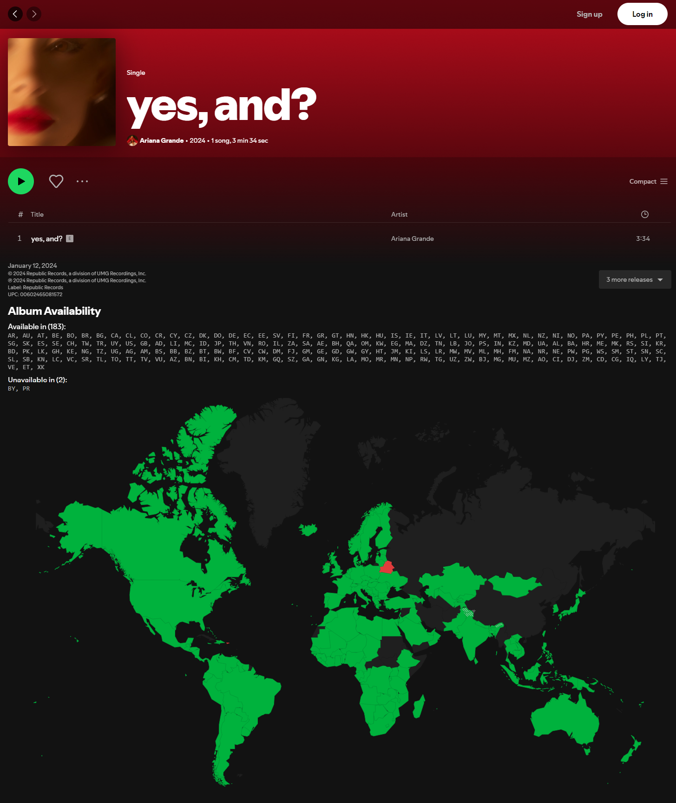
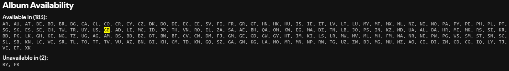

# Spotify Album Availability

Show in which countries the album is available and in which it is unavailable. Additionally, show the label and UPC code. The script is also available for Deezer [here](https://github.com/pawllo01/deezer-album-availability).



## Installing

Install [the script](https://github.com/pawllo01/spotify-album-availability/raw/main/spotify-album-availability.user.js) using [Tampermonkey](https://chromewebstore.google.com/detail/tampermonkey/dhdgffkkebhmkfjojejmpbldmpobfkfo) or another userscript manager.

If you're using Tampermonkey, make sure to enable Developer Mode. - [tutorial](https://www.tampermonkey.net/faq.php?locale=en#Q209)

### Set Your Default Country (Optional)

You can set your default country by editing the script. This small feature highlights your country code, making it easier to spot. For example:

```js
const YOUR_COUNTRY_CODE = 'GB';
```



### MusicBrainz Lookup (Optional)

You can enable MusicBrainz Lookup by setting `showMusicBrainzLookup` to `true`. The link will appear next to the UPC code, allowing you to quickly find the release on MusicBrainz.
